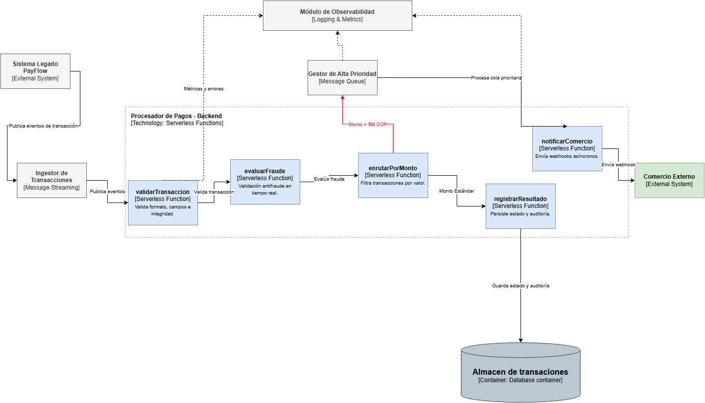

# 🏦 PayFlow — Arquitectura Event-Driven en Microsoft Azure

## 📘 Trabajo Grupal — Computación en la Nube

---

## 👨‍🏫 Información académica

| Campo | Información |
|---|---|
| Institución | Tecnológico de Antioquia — Institución Universitaria |
| Curso | Computación en la Nube |
| Semestre | 2026-1 |
| Profesor | Julian David Florez Sanchez |
| Caso | Caso 03 — Procesamiento de Eventos en Tiempo Real |
| Plataforma | Microsoft Azure |
| Fecha de entrega | 14 de mayo de 2026 |

---

## 👥 Integrantes

| Nombre |
|---|
| Jose Luis Parra |
| Isaac Gomez |
| Emerson raul |


---

# 📌 Descripción del proyecto

PayFlow es una fintech colombiana especializada en pagos digitales para pequeños y medianos comercios.  
Actualmente su plataforma presenta problemas de rendimiento, acoplamiento y detección tardía de fraude debido a una arquitectura monolítica y síncrona.

Este proyecto propone una nueva arquitectura basada en eventos utilizando servicios cloud de Microsoft Azure, permitiendo:

- Procesamiento en tiempo real
- Escalabilidad ante picos de demanda
- Desacoplamiento de servicios
- Priorización de transacciones de alto valor
- Observabilidad centralizada
- Detección temprana de errores y fraude

La solución implementa una arquitectura **Event-Driven** usando Azure Event Hubs, Azure Functions, Azure Service Bus, Cosmos DB y Azure Monitor.

---

# 🎯 Objetivos del proyecto

## Objetivo general
Diseñar e implementar una arquitectura cloud orientada a eventos para el procesamiento de transacciones financieras en tiempo real utilizando Microsoft Azure.

---

## Objetivos específicos

- Diseñar el modelo arquitectónico C4 del sistema PayFlow.
- Implementar un flujo de procesamiento de transacciones basado en eventos.
- Desacoplar el procesamiento crítico de las notificaciones externas.
- Implementar monitoreo y observabilidad en tiempo real.
- Evaluar decisiones arquitectónicas mediante ADRs.

---

# 🏗️ Arquitectura propuesta

## 🔹 Diagrama C1 — Contexto


---

## 🔹 Diagrama C2 — Contenedores


---

## 🔹 Diagrama C3 — Componentes



---

# ☁️ Stack tecnológico

| Servicio Azure | Función |
|---|---|
| Azure Event Hubs | Ingesta de eventos de transacciones |
| Azure Functions | Procesamiento y validación |
| Azure Service Bus | Manejo de transacciones de alto valor |
| Cosmos DB | Persistencia de datos |
| Azure Monitor + App Insights | Observabilidad y monitoreo |

---

# 📂 Estructura del repositorio

```bash
/src
/assets
/docs
README.md
