# PayFlow — Arquitectura Event-Driven para Procesamiento de Transacciones

---

# Computación en la Nube — Caso 03

## Procesamiento de Eventos en Tiempo Real

| Campo | Información |
|---|---|
| Institución | Tecnológico de Antioquia |
| Curso | Computación en la Nube |
| Profesor | Julian David Florez Sanchez |
| Semestre | 2026-1 |
| Plataforma | Microsoft Azure |
| Fecha de entrega | 14 de mayo de 2026 |

---

# Integrantes

| Nombre | 
|---|
| Jose luis Parra |
| Isaac Gomez | 
| Emerson Atehortua| 

---

# Tabla de contenido

1. Introducción  
2. Drivers Arquitectónicos  
3. Modelo C4  
4. Architectural Decision Records (ADRs)  
5. Implementación del flujo crítico  
6. Evidencias de implementación  
7. Matriz de control de cambios  
8. Conclusiones  
9. Referencias  

---

# Introducción

PayFlow es una fintech colombiana enfocada en pagos digitales para pequeños y medianos comercios. Actualmente, su plataforma presenta limitaciones de rendimiento y escalabilidad debido a una arquitectura monolítica y síncrona que no soporta correctamente los picos de transacciones.

El propósito de este proyecto es diseñar una arquitectura orientada a eventos que permita mejorar el procesamiento en tiempo real, desacoplar componentes críticos, aumentar la observabilidad del sistema y soportar crecimiento en volumen transaccional.

---
# Descripción de la empresa
PayFlow es una fintech colombiana fundada en 2020 que ofrece una plataforma de pagos
digitales para pequeños y medianos comercios. Opera como intermediario entre comercios,
adquirentes bancarios y redes de pago (Visa, Mastercard, PSE), procesando transacciones de
compra, reembolsos, pagos de servicios y transferencias entre cuentas.
PayFlow cuenta actualmente con 28.000 comercios activos, procesa en promedio 85.000
transacciones diarias y tiene presencia en Colombia, Ecuador y Perú. En temporada alta
(noviembre-diciembre y semana de receso escolar) el volumen puede triplicarse, alcanzando
hasta 260.000 transacciones en un solo día

# Situación tecnológica actual y problemas identificados

El sistema de procesamiento de transacciones de PayFlow fue construido en 2020 sobre una arquitectura síncrona y monolítica. Cada transacción pasa por un flujo secuencial de validación, autorización, registro y notificación que debe completarse en **menos de 3 segundos** para no generar *timeout* en el comercio.

---

##  Problemas Críticos Identificados

Esta arquitectura presenta deficiencias estructurales que amenazan directamente la operación y el crecimiento de la plataforma:

* **Cuello de botella en picos de demanda**
  El procesador central actual maneja un máximo de **40 transacciones por segundo**. En temporada alta, cuando el volumen supera ese umbral, las transacciones comienzan a encolarse y el tiempo de respuesta supera los **8 segundos**, generando rechazos en los terminales de los comercios y pérdida de ventas.

* **Sin separación entre flujos críticos y no críticos**
  Una transacción de $500 COP y una de $50.000.000 COP pasan exactamente por el mismo proceso con la misma prioridad. Esto expone al sistema a que un alto volumen de micropagos bloquee por completo el procesamiento de transacciones de alto valor.

* **Detección de fraude reactiva**
  El sistema actual solo aplica reglas antifraude después de autorizar la transacción. Cuando se detecta una operación sospechosa, la transacción ya fue aprobada y el dinero comprometido. El equipo de riesgo opera con alertas manuales revisadas horas después.

* **Observabilidad limitada**
  No existe un sistema centralizado de monitoreo. Cuando hay problemas de procesamiento, el equipo de operaciones se entera por quejas de los comercios en *WhatsApp*, no por alertas automáticas del sistema.

* **Acoplamiento fuerte entre validación y notificación**
  Si el servicio de notificación al comercio (*webhook*) falla, la transacción completa se revierte, aunque la autorización bancaria haya sido exitosa. Esto genera inconsistencias críticas entre el estado en PayFlow y el estado real en la red de pago.

---

# Drivers Arquitectónicos

Los siguientes drivers fueron identificados a partir de los requerimientos funcionales y no funcionales del caso de estudio.

---

## Throughput

| Requerimiento | Objetivo |
|---|---|
| Capacidad de procesamiento | Hasta 500 transacciones por segundo |

### Motivación
Soportar temporadas de alta demanda sin degradación del servicio.

---

## Latencia

| Requerimiento | Objetivo |
|---|---|
| Tiempo de autorización | Menor a 2 segundos |

### Motivación
Evitar timeouts en terminales de pago y pérdida de ventas.

---

## Garantía de entrega

| Requerimiento | Objetivo |
|---|---|
| Entrega de eventos | At-least-once |

### Motivación
Garantizar que ninguna transacción crítica se pierda durante el procesamiento.

---

## Detección de fraude

| Requerimiento | Objetivo |
|---|---|
| Evaluación antifraude | En tiempo real antes de autorizar |

### Motivación
Reducir transacciones fraudulentas aprobadas.

---

## Desacoplamiento

| Requerimiento | Objetivo |
|---|---|
| Separación de flujos | Independencia entre autorización y notificaciones |

### Motivación
Evitar que fallos externos afecten el procesamiento principal.

---

## Observabilidad

| Requerimiento | Objetivo |
|---|---|
| Monitoreo automático | Alertas menores a 30 segundos |

### Motivación
Detectar anomalías antes de que sean reportadas por los comercios.

---
# Restricciones del Proyecto

El desarrollo y despliegue de la solución está sujeto a las siguientes condiciones normativas, técnicas y presupuestarias:

* **Cumplimiento regulatorio de datos**
  PayFlow opera bajo la regulación de la Superintendencia Financiera de Colombia. Por este motivo, todos los datos de las transacciones deben almacenarse obligatoriamente en territorio colombiano o en regiones certificadas. La región de Azure recomendada para este cumplimiento es Brazil South.

* **Stack tecnológico del equipo**
  El equipo de ingeniería cuenta con experiencia consolidada en Python y Node.js. En consecuencia, las Azure Functions requeridas por la nueva arquitectura deben implementarse exclusivamente en uno de estos dos lenguajes.

* **Límite de presupuesto operativo**
  El presupuesto asignado en Azure no debe superar los $60 USD mensuales durante la fase piloto. Para cumplir con esta restricción, se deben utilizar los *tiers* básicos de bajo costo de Event Hubs y Service Bus, los cuales son suficientes para soportar el prototipo.
---

# Modelo C4

---

# C1 — Contexto

## Descripción

El diagrama C1 representa los actores principales y sistemas externos que interactúan con PayFlow dentro del ecosistema de procesamiento de pagos.

### Actores identificados

- Cliente
- Comercio
- Equipo de Riesgo
- Equipo de Operaciones

### Sistemas externos

- Terminal POS
- Sistema legado
- Red de pagos externa

---

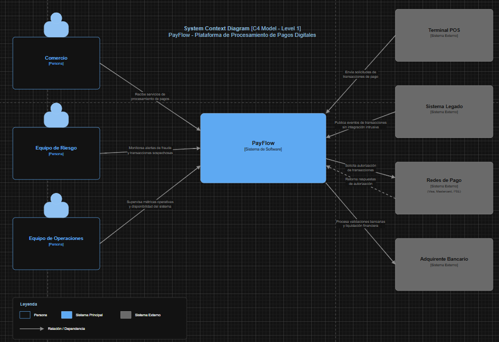

## C1 — Contexto

### Descripción del Escenario de Contexto

El diagrama de Contexto del Sistema (Nivel 1) delimita las fronteras operacionales de la plataforma **PayFlow**, identificando de forma explícita a los actores humanos y a los sistemas externos que interactúan con el ecosistema de procesamiento de eventos distribuidos sobre la infraestructura de nube.

El objetivo central de la plataforma es proveer un canal seguro, altamente escalable y elástico que faculte a los comercios para la recepción y autorización de pagos digitales eficientes dentro de la región (Colombia, Ecuador y Perú), garantizando interoperabilidad táctica tanto con infraestructuras legadas como con redes financieras tradicionales.

---

### Entidades y Actores Identificados

#### Actores del Sistema

| Actor | Alcance y Frontera Operativa |
| :--- | :--- |
| **Comercio** | Establecimientos comerciales y negocios afiliados que consumen los servicios de la plataforma para procesar los cobros digitales de sus clientes, emitiendo solicitudes de autorización y recibiendo notificaciones asíncronas de conformidad. |
| **Equipo de Riesgo** | Unidad interna encargada de la gobernanza de seguridad, supervisión de transacciones anómalas, gestión de alertas de fraude financiero y auditoría de comportamiento transaccional dentro del sistema. |
| **Equipo de Operaciones** | Responsables de la administración de la infraestructura y de velar por la alta disponibilidad de la solución mediante el monitoreo de métricas operativas y trazas lógicas en tiempo real. |

#### Sistemas Externos

| Sistema Externo | Tipo de Componente | Responsabilidad de Integración |
| :--- | :--- | :--- |
| **Terminal POS** | Dispositivo Físico / Cliente | Captura la información de las credenciales de pago del tarjetahabiente en el punto de venta y despacha las peticiones de cobro hacia la plataforma. |
| **Sistema Legado** | Aplicación Monolítica | Componente tecnológico preexistente que se mantiene operativo durante la fase de migración, asegurando la coexistencia y transferencia fluida de datos sin impactos en el negocio. |
| **Redes de Pago** | Pasarela Externa (Visa/Mastercard/PSE) | Servicios de clearing financiero encargados de validar las reglas de negocio bancarias para emitir las respuestas finales de aprobación o rechazo transaccional. |
| **Adquirente Bancario** | Entidad Financiera | Institución responsable del procesamiento monetario definitivo, la validación de fondos y el proceso de liquidación de las transacciones hacia los comercios. |

---

### Responsabilidades del Sistema Principal (PayFlow)

Como núcleo de la arquitectura guiada por eventos desplegada en la infraestructura cloud, la plataforma asume las siguientes responsabilidades globales:
* **Ingesta Distribución de Datos**: Absorber de forma concurrente solicitudes masivas de transacciones financieras digitales originadas en múltiples puntos de venta.
* **Control del Ciclo de Vida de Autorizaciones**: Coordinar de forma orquestada la lógica de mensajería para evaluar, enrutar y validar las solicitudes de pago.
* **Emisión y Publicación de Trazas**: Actuar como origen de eventos emitiendo notificaciones estructuradas de transacciones a través de tópicos compartidos.
* **Integración Heterogénea**: Proveer adaptadores de comunicación estándar para enlazarse con los ecosistemas de las redes de pago y adquirentes tradicionales.
* **Garantía de Atributos de Calidad**: Soportar de manera nativa escalabilidad horizontal automatizada, tolerancia a fallos, aislamiento de excepciones y alta disponibilidad operacional.

---

### Catálogo de Relaciones Principales

El flujo de interacción de alto nivel entre las fronteras del sistema se rige bajo los siguientes principios de comunicación:
1. El **Comercio** canaliza e inicia el ciclo transaccional consumiendo las capacidades de procesamiento distribuidas por la plataforma.
2. El **Terminal POS** actúa como interfaz física enviando las solicitudes técnicas de autorización hacia los componentes de entrada del backend.
3. La plataforma interactúa mediante protocolos seguros con las **Redes de Pago** para requerir los veredictos financieros de los adquirentes bancarios.
4. Las **Redes de Pago** retornan de manera síncrona o asíncrona la respuesta estructural de aprobación o denegación de la operación monetaria.
5. El **Adquirente Bancario** ejecuta los procesos de compensación y liquidación monetaria final derivados de las transacciones validadas exitosamente.
6. El **Sistema Legado** mantiene un intercambio constante de eventos informativos y sincronización de datos con la nueva plataforma para resguardar la consistencia operativa del negocio.
7. Los equipos de **Riesgo** y **Operaciones** explotan las interfaces de monitoreo de forma transversal para auditar la salud del ecosistema y contener comportamientos fraudulentos.
---

# C2 — Contenedores

## Descripción

El diagrama C2 representa los principales contenedores del sistema y el flujo general de procesamiento de eventos dentro de la arquitectura propuesta.

### Responsabilidades identificadas

| Contenedor | Responsabilidad |
|---|---|
| Ingesta de eventos | Recepción de transacciones |
| Procesamiento | Validación y reglas de negocio |
| Enrutamiento prioritario | Manejo de transacciones críticas |
| Persistencia | Almacenamiento del estado de transacciones |
| Observabilidad | Monitoreo y métricas |

---

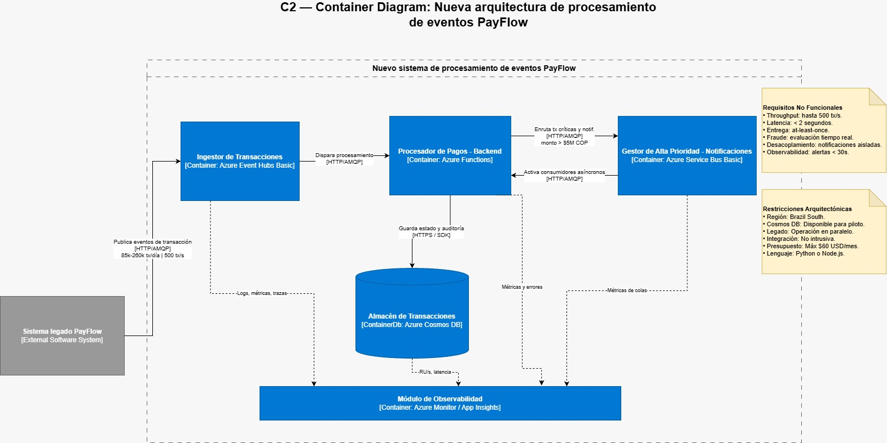

El diagrama C2 representa la nueva arquitectura de procesamiento de eventos de PayFlow a nivel de contenedores. El flujo inicia en el sistema legado, que continúa funcionando durante la fase piloto y publica eventos de transacción hacia la nueva arquitectura mediante HTTP/AMQP. Estos eventos son recibidos por el ingestor de transacciones, encargado de actuar como punto de entrada y buffer para desacoplar el monolito del nuevo procesamiento.

Luego, el procesador de pagos consume los eventos, valida la información, aplica reglas antifraude básicas, clasifica las transacciones por monto y registra los resultados. Cuando una transacción requiere tratamiento especial, como las mayores a $5M COP, se envía al gestor de alta prioridad, donde se manejan colas asíncronas para priorización, auditoría obligatoria y notificaciones desacopladas del flujo de autorización.

El almacén de transacciones conserva el estado final, trazabilidad, auditoría y datos operativos de cada transacción procesada. Finalmente, el módulo de observabilidad recibe métricas, trazas, errores y alertas de los demás contenedores, permitiendo monitorear throughput, latencia, disponibilidad y posibles anomalías antes de que afecten a los comercios.

---

# C3 — Componentes

## Descripción

El diagrama C3 representa los componentes internos encargados del procesamiento de transacciones y la lógica de negocio del sistema.

### Componentes internos

| Componente | Responsabilidad |
|---|---|
| validarTransaccion | Validación de estructura y formato |
| evaluarFraude | Aplicación de reglas antifraude |
| enrutarPorMonto | Priorización de transacciones |
| registrarResultado | Persistencia del resultado |
| notificarComercio | Confirmación del procesamiento |

---

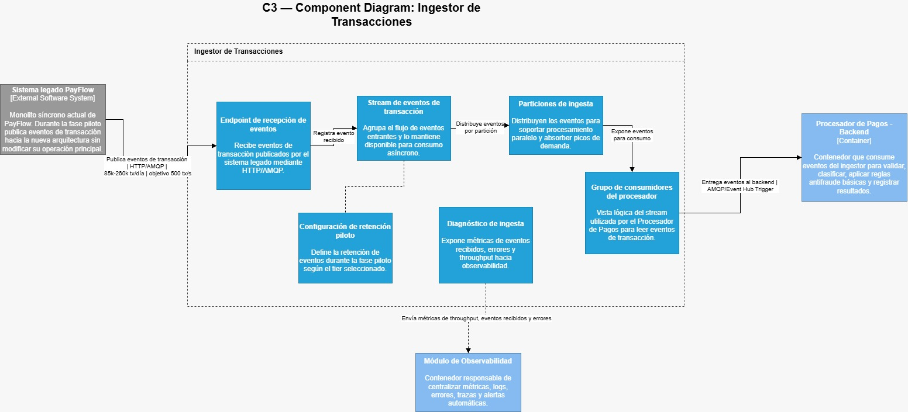
Este diagrama descompone el contenedor Ingestor de Transacciones, encargado de recibir los eventos publicados por el sistema legado de PayFlow mediante HTTP/AMQP. Su función principal es actuar como punto de entrada y buffer del nuevo flujo, permitiendo desacoplar el monolito del procesamiento posterior y soportar picos de demanda. Además, expone métricas de ingesta para que el módulo de observabilidad pueda monitorear volumen, errores y comportamiento del flujo de entrada.

---
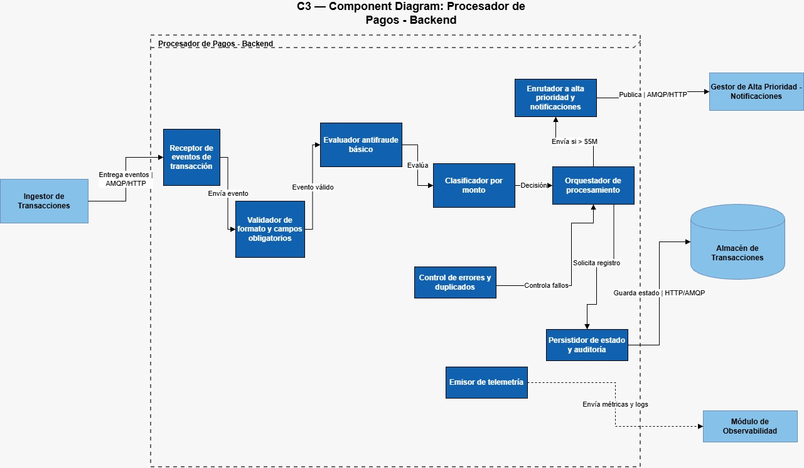
Este diagrama representa los componentes internos del Procesador de Pagos, responsable de ejecutar la lógica principal del procesamiento de eventos. Dentro de este contenedor se validan los datos de la transacción, se aplican reglas antifraude básicas, se clasifica la operación por monto y se decide si debe enviarse al canal de alta prioridad. También registra resultados en el almacén de transacciones y reporta métricas, errores y trazas al módulo de observabilidad.

---
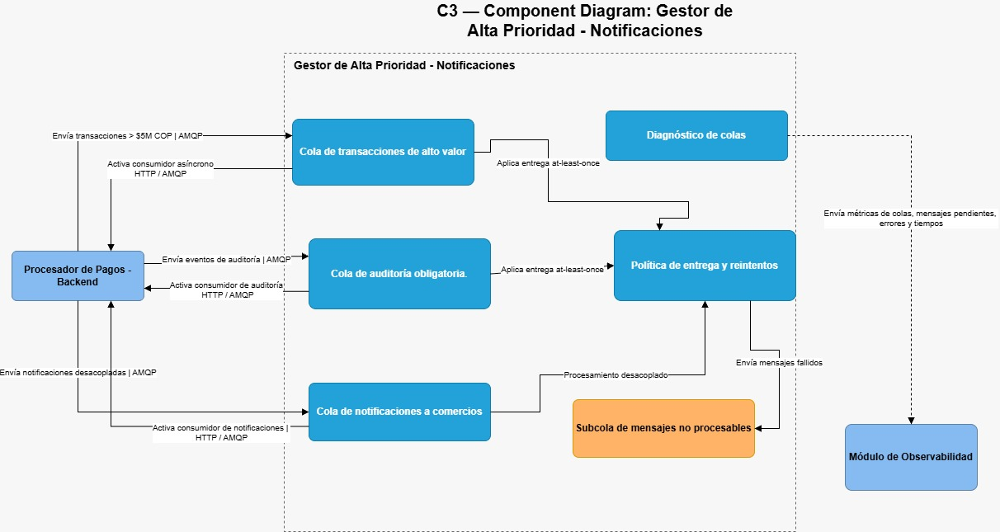
Este diagrama descompone el contenedor Gestor de Alta Prioridad - Notificaciones, cuya responsabilidad es administrar colas asíncronas para separar flujos críticos y no críticos. Permite manejar transacciones mayores a $5.000.000 COP por un canal diferenciado, registrar eventos de auditoría obligatoria y procesar notificaciones a comercios de forma desacoplada. Con esto se evita que una falla en las notificaciones afecte el flujo principal de autorización.

---
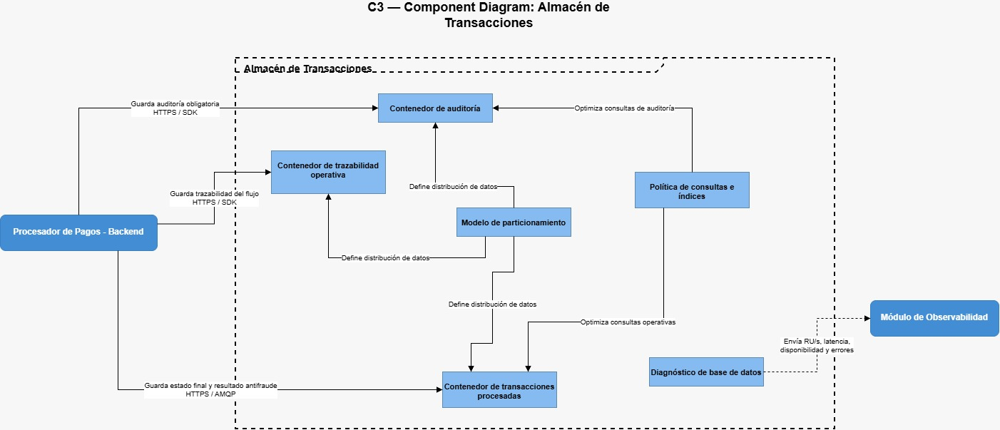
Este diagrama muestra la estructura lógica del Almacén de Transacciones, encargado de persistir el estado final de cada transacción procesada. También conserva resultados antifraude, información de auditoría, trazabilidad y datos operativos necesarios para reconstruir el recorrido de una transacción. Su diseño permite centralizar la información clave del procesamiento sin incluir lógica de negocio, la cual permanece en el Procesador de Pagos.

---
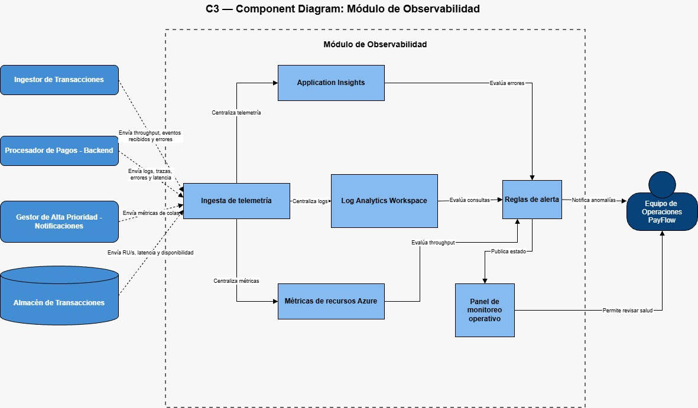
Este diagrama descompone el Módulo de Observabilidad, responsable de centralizar métricas, logs, trazas, errores, latencia y alertas del sistema. Recibe información desde los demás contenedores para permitir el monitoreo del flujo completo de procesamiento. Su objetivo es facilitar la detección temprana de anomalías, apoyar el seguimiento del throughput y permitir que el equipo de operaciones identifique problemas antes de que impacten a los comercios

---
# Architectural Decision Records (ADRs)

---

# Registro de Decisiones de Arquitectura (ADRs) — Proyecto PayFlow

## ADR-01: Azure Event Hubs vs Azure Service Bus como punto de entrada de eventos de transacciones

### Contexto
El sistema legado de PayFlow procesa hasta 40 transacciones por segundo (tx/s) de forma síncrona. Durante temporada alta (noviembre–diciembre), el volumen puede triplicarse hasta alcanzar 260.000 transacciones diarias, lo que equivale a picos sostenidos de más de 500 tx/s. Cuando ese umbral se supera, los tiempos de respuesta escalan de 2 a más de 8 segundos, causando timeouts en los terminales POS de los comercios y pérdida directa de ventas.

La nueva arquitectura debe recibir el flujo de eventos del sistema legado sin requerir modificaciones en él (integración no intrusiva) y actuar como buffer distribuido ante esos picos. El punto de entrada es el componente más crítico: debe absorber ráfagas de alto volumen, ser tolerante a fallos y permitir que los consumidores (Azure Functions) procesen a su propio ritmo sin bloquear la ingesta.

### Alternativas evaluadas

#### Opción A — Azure Event Hubs (Seleccionada)
Azure Event Hubs es un servicio de streaming de eventos de alto rendimiento diseñado para ingerir millones de eventos por segundo. Actúa como la puerta principal en arquitecturas event-driven, proporcionando una cola de retención configurable donde los consumidores leen eventos de forma independiente.

* Throughput masivo: Escala hasta millones de eventos/seg; soporta los 500 tx/s requeridos con amplio margen.
* Buffer distribuido: La retención de 1 día (Basic tier) protege contra caídas temporales de la capa de procesamiento (Azure Functions).
* Compartibilidad AMQP: El sistema legado puede publicar transacciones por AMQP sin modificaciones intrusivas.
* Integración nativa con Functions: El trigger de Event Hubs permite procesar lotes de datos eficientemente.
* Costo optimizado: El Basic tier (1 unidad de procesamiento) se alinea con el presupuesto del piloto de $60 USD/mes.

Desventajas: No garantiza orden estricto entre particiones de forma nativa sin llaves de partición; no tiene dead-letter queue nativa; retención máxima de 1 día en Basic tier.

#### Opción B — Azure Service Bus como punto de entrada (Descartada)
Azure Service Bus es un broker de mensajería empresarial orientado a mensajes individuales con garantías de orden y entrega. Si bien ofrece dead-letter queues y sesiones ordenadas, no está optimizado para absorber ráfagas continuas de streaming de alto volumen.

* Límite de throughput: El Basic tier presenta degradación y overhead bajo cargas concurrentes y sostenidas de 500 tx/s.
* Latencia de ingesta mayor: El protocolo maneja cada mensaje de forma individualizada, añadiendo latencia extrema en la fase de absorción de ráfagas.
* Costo por operación: El modelo de precios basado en cobros por mensaje individual escala negativamente con un volumen de 85k–260k tx/día.

### Decisión
Se selecciona Azure Event Hubs como punto de entrada del sistema de procesamiento de eventos de PayFlow. Event Hubs cumple con éxito el rol de ingesta masiva (event ingestion), permitiendo una integración no intrusiva mediante AMQP con el sistema fuente, mientras que las Azure Functions procesan los lotes asíncronamente mediante suscripción declarativa.

### Consecuencias
* Ventajas obtenidas: Capacidad de absorber picos de 500 tx/s sin degradación, desacoplamiento completo entre ingesta y procesamiento, y persistencia temporal como amortiguador (buffer).
* Trade-offs asumidos: Ausencia de orden estricto entre particiones (aceptable dado que las transacciones financieras de comercios diferentes son independientes entre sí). La falta de Dead-Letter Queue (DLQ) nativa se mitiga mediante el control de excepciones implementado en el código de Azure Functions.

---

## ADR-02: Azure Functions vs Azure Stream Analytics para el procesamiento de cada evento de transacción

### Contexto
Una vez que el evento de transacción es ingestado por Event Hubs, debe ser procesado aplicando una cadena de lógica de negocio condicional: validación de formato, evaluación antifraude en tiempo real, enrutamiento por monto y registro del resultado. Esta cadena debe completarse en menos de 2 segundos en el percentil P99 y necesita ejecutar reglas imperativas complejas (por ejemplo, detectar si el monto supera los $5.000.000 COP para enrutar a la cola de alta prioridad). El equipo de ingeniería tiene experiencia en Python, el presupuesto es ajustado ($60 USD/mes) y el procesamiento debe ser stateless para escalar horizontalmente de forma elástica.

### Alternativas evaluadas

#### Opción A — Azure Functions (Seleccionada)
Azure Functions es un servicio de cómputo serverless orientado a eventos. Con el trigger de Event Hubs, cada lote de transacciones activa automáticamente una instancia que ejecuta el pipeline. El plan Consumption incluye 1 millón de ejecuciones gratuitas por mes.

* Lógica arbitraria imperativa: Permite codificar reglas complejas, validaciones estrictas de JSON y enrutamientos avanzados utilizando Python.
* Escala automática: El runtime escala horizontalmente agregando instancias según el backlog acumulado en Event Hubs.
* Costo cero en piloto: El Consumption Plan cubre la demanda del prototipo dentro de su capa gratuita.
* Despliegue granular: Permite modularizar el flujo en componentes independientes tal como exige el modelo C3 (validar, evaluar fraude, enrutar, registrar, notificar).

Desventajas: Presencia de Cold start (~200–800 ms) ante inactividad prolongada; no está optimizado nativamente para agregaciones matemáticas en ventanas de tiempo complejas.

#### Opción B — Azure Stream Analytics (Descartada)
Azure Stream Analytics es un motor de procesamiento complejo de eventos (CEP) basado en sintaxis SQL para consultas de ventana temporal y analítica continua en tiempo real.

* Limitación de lógica imperativa: Las reglas de enrutamiento condicional avanzado y las validaciones de negocio minuciosas no se expresan de forma limpia en SQL de streams.
* Costos elevados: Requiere una tarifa mínima por unidad de streaming (~$80 USD/mes), lo cual excede el presupuesto total asignado al piloto.

### Decisión
Se selecciona Azure Functions en Consumption Plan como el motor de procesamiento. La lógica de PayFlow es inherentemente imperativa y estructurada por etapas independientes (C3), alineándose de forma directa con el paradigma Serverless.

### Consecuencias
* Ventajas obtenidas: Pipeline altamente escalable (escala a cero si no hay transacciones), desarrollo ágil en Python y nulo impacto económico en la fase de pruebas.
* Trade-offs asumidos: El posible impacto latente de los cold starts se asume en el piloto, siendo mitigable en producción mediante planes Premium (Always On). El monitoreo y debugging distribuido se delega por completo a Application Insights.

---

## ADR-03: Azure Cosmos DB para la persistencia del estado de transacciones

### Contexto
Cada transacción procesada por la capa de cómputo debe ser persistida con su estado final descriptivo (aprobada, rechazada, en_revision) e incluir metadatos de auditoría obligatorios. Las escrituras de alta concurrencia ocurren en momentos de máxima carga (hasta 500 tx/s en picos estacionales). Adicionalmente, el modelo de datos es heterogéneo: los campos y la estructura varían significativamente según el método de pago (Débito, Crédito, PSE, Reembolsos).

### Alternativas evaluadas

#### Opción A — Azure Cosmos DB (API for NoSQL) (Seleccionada)
Azure Cosmos DB es una base de datos NoSQL distribuida globalmente que garantiza latencias de lectura y escritura inferiores a 10 ms en el percentil P99 en la misma región. Su naturaleza basada en documentos JSON mapea de forma directa con los eventos transaccionales.

* Latencia ultrabaja (Sub-10ms): El alto rendimiento de escritura asegura cumplir con holgura el SLA extremo a extremo de 2 segundos.
* Esquema flexible (Schema-agnostic): Permite la coexistence nativa de payloads heterogéneos en el mismo contenedor sin necesidad de migraciones de tablas o esquemas rígidos.
* Escala elástica de RU/s: Permite ajustar el rendimiento de forma dinámica ante picos transaccionales.
* Integración: El uso del SDK oficial para Python facilita la persistencia directa desde la Azure Function registrarResultado.

Desventajas: Costos elevados si se configuran Request Units (RU/s) excesivas sin optimización; requiere un diseño riguroso de la clave de partición para evitar "hot partitions".

#### Opción B — Azure SQL Database (Descartada)
Base de datos relacional tradicional basada en un motor ACID estructurado.

* Rigidez de esquema: Exige declaraciones de esquemas previas (DDL) y tablas relacionales rígidas, complicando el almacenamiento de múltiples tipos dinámicos de transacción.
* Riesgo de bloqueo por concurrencia: Bajo cargas intensas de 500 tx/s, el bloqueo de filas y tablas relacionales genera contención, elevando la latencia por encima del umbral requerido de 2 segundos.

### Decisión
Se implementa Azure Cosmos DB (API for NoSQL) como almacén definitivo de transacciones. El contenedor se configura con la partición lógica orientada por el campo comercio_id para asegurar una distribución uniforme de la carga horizontal y maximizar la eficiencia de las Request Units (RU/s). Se cumple la restricción técnica al inyectar el campo obligatorio de auditoría diferenciada (audit_trail) para registros que superen el monto de $5.000.000 COP.

### Consecuencias
* Ventajas obtenidas: Rendimiento transaccional garantizado con latencias de escritura de milisegundos de un solo dígito y compatibilidad directa con el formato JSON nativo de los eventos.
* Trade-offs asumidos: Se debe monitorear el consumo de RU/s desde la telemetría para evitar la aparición de excepciones de tipo 429 (Too Many Requests) si se satura el aprovisionamiento bajo la carga máxima.

---

## ADR-04: Azure Service Bus vs Azure Storage Queue para el enrutamiento de transacciones de alto valor

### Contexto
Las transacciones que superen un monto de $5.000.000 COP representan un riesgo crítico de negocio y requieren un canal de procesamiento diferenciado con auditoría rigurosa y entrega garantizada de tipo At-least-once. El envío de notificaciones hacia el comercio externo (Webhooks) es propenso a latencias de red y caídas del servidor destino.

Para evitar cuellos de botella en el flujo transaccional masivo, el proceso de notificación debe desacoplarse completamente. Un fallo o retraso en la entrega del webhook del comercio no debe bajo ninguna circunstancia revertir o bloquear el registro de la autorización bancaria previamente asentada.

### Alternativas evaluadas

#### Opción A — Azure Service Bus (Seleccionada)
Azure Service Bus es un message broker empresarial de alta confiabilidad que proporciona semánticas de mensajería avanzadas, incluyendo transaccionalidad local, reintentos con backoff exponencial y colas de mensajes fallidos (Dead-Letter Queues).

* Garantía At-least-once: Asegura contractualmente que ningún mensaje financiero crítico de alto valor se pierda.
* Mecanismo Peek-Lock: El mensaje permanece protegido en la cola y solo se elimina cuando el consumidor confirma el procesamiento exitoso. Si el consumidor falla, el mensaje vuelve a estar disponible para su reintento.
* Dead-Letter Queue (DLQ) nativa: Si un mensaje agota los reintentos permitidos debido a una caída prolongada del comercio, se desvía de forma automática a la DLQ para auditoría manual por el equipo de riesgo, sin perder la trazabilidad.
* Desacoplamiento asíncrono: Aísla el procesamiento pesado de notificaciones fuera del hilo principal de ejecución.

Desventajas: El Basic tier limita el tamaño máximo del mensaje a 256 KB y restringe el uso de tópicos avanzados (disponibles solo en Standard), lo cual es suficiente para el alcance del piloto.

#### Opción B — Azure Storage Queue (Descartada)
Es un servicio de colas simple basado en Azure Storage, diseñado para un gran volumen de mensajes de baja criticidad.

* Falta de Dead-Letter Queue nativa: Si un mensaje falla repetidamente, se requiere lógica manual compleja para evitar su pérdida o el bucle infinito de procesamiento, arriesgando la auditoría de alto valor.
* Limitación de tamaño rígida: Soporta un tamaño máximo estricto de 64 KB, insuficiente si el payload de auditoría se expande con evidencias o firmas criptográficas complejas.

### Decisión
Se selecciona Azure Service Bus Basic Tier para gestionar la cola dedicada a las transacciones de alto valor (>5M COP).

El desacoplamiento se implementa delegando de forma exclusiva la responsabilidad de la notificación externa a la función notificarComercio, la cual actúa como consumidor único de la cola de Service Bus. De esta manera, tal como se modeló en el diagrama C3, la función principal enrutarPorMonto envía la transacción de forma paralela e independiente: por un lado, se asegura el flujo de persistencia en Cosmos DB mediante registrarResultado y, por el otro, se inyecta el evento en Service Bus. Si el webhook del comercio falla o experimenta alta latencia, el registro de la transacción permanece a salvo e inalterado en la base de datos NoSQL.

### Consecuencias
* Ventajas obtenidas: Tolerancia total a fallos ante interrupciones de servicios de terceros, preservación obligatoria de pistas de auditoría financiera mediante DLQ y eliminación de cuellos de botella en la experiencia del usuario.
* Trade-offs asumidos: El Basic tier soporta únicamente colas simples (queues) y no tópicos de publicación masiva. Si a futuro se requiere enrutar transacciones a múltiples sistemas independientes en paralelo, se deberá migrar al Standard Tier.

---

## ADR-05: Azure Monitor + Application Insights como solución de observabilidad centralizada

### Contexto
El sistema actual de PayFlow carece de monitoreo centralizado; los incidentes operativos son reportados manualmente por los comercios mediante canales externos como WhatsApp. La nueva arquitectura orientada a eventos distribuidos requiere un sistema automático capaz de alertar en un tiempo menor a 30 segundos ante anomalías críticas: caídas bruscas en el throughput, elevadas tasas de error HTTP o latencias en el percentil P99 que superen los 2 segundos de SLA. El monitoreo debe vigilar todo el stack y operar bajo la restricción económica del piloto, manteniendo la soberanía regulatoria de los datos financieros en el territorio estipulado.

### Alternativas evaluadas

#### Opción A — Azure Monitor + Application Insights (Seleccionada)
Es el ecosistema de observabilidad nativo de Microsoft Azure. Recolecta métricas distribuidas, logs detallados y trazas de telemetría de forma nativa a través de los componentes en la nube.

* Integración nativa sin agentes (Zero-Config): La telemetría se activa en las Azure Functions mediante la inyección directa de variables de entorno de instrumentación, correlacionando el ciclo de vida del evento automáticamente.
* Alertas de baja latencia: Las alertas configuradas sobre las métricas de plataforma permiten la evaluación en tiempo real de la salud de Event Hubs, Azure Functions y Service Bus.
* Cumplimiento de soberanía y presupuesto: Los componentes se despliegan en la misma región de infraestructura (Brazil South), asegurando el cumplimiento estricto con las directrices de la Superintendencia Financiera de Colombia respecto a la localización de datos transaccionales. Además, el consumo se mantiene a costo cero gracias a la capa gratuita de 5 GB mensuales de ingesta de logs.

Desventajas: Requiere el aprendizaje de KQL (Kusto Query Language) para diagnósticos avanzados y consultas complejas en los repositorios de logs.

#### Opción B — Datadog / New Relic (Descartada)
Plataformas comerciales líderes en el sector de la observabilidad y APM empresarial.

* Costos excesivos: Los planes comerciales básicos superan por completo los $60 USD/mes presupuestados para todo el piloto.
* Fricción de cumplimiento (Soberanía de Datos): Estas soluciones de terceros exportan los logs financieros fuera del tenant privado de Azure hacia servidores externos alojados en regiones internacionales, rompiendo los lineamientos de cumplimiento con la entidad reguladora del país.

### Decisión
Se selecciona el combo nativo Azure Monitor + Application Insights centralizado en la región Brazil South. Para satisfacer el requerimiento de detección de anomalías en menos de 30 segundos, las reglas de alerta automática se configuran sobre las métricas de plataforma nativas (Métricas de Ingesta, Duración del Runtime y Recuento de Mensajes Activos), evitando la latencia de indexación que presentan las alertas basadas en análisis de logs planos.

### Consecuencias
* Ventajas obtenidas: Trazabilidad distribuida automática a lo largo de todo el ciclo de vida del evento transaccional (operation_Id compartido), visibilidad en tiempo real mediante Dashboards integrados (Workbooks) y costo operativo cero en la fase inicial del piloto.
* Trade-offs asumidos: El equipo asume la curva de aprendizaje obligatoria sobre KQL para ejecutar consultas avanzadas dentro de las trazas del sistema, garantizando diagnósticos efectivos ante incidentes de producción.

---

# Implementación del flujo crítico

## Flujo implementado

1. Generación de eventos de transacciones.
2. Recepción de eventos.
3. Validación y procesamiento.
4. Priorización de transacciones críticas.
5. Persistencia del estado final.
6. Monitoreo y generación de métricas.

---

# Evidencias de implementación

## Infraestructura desplegada

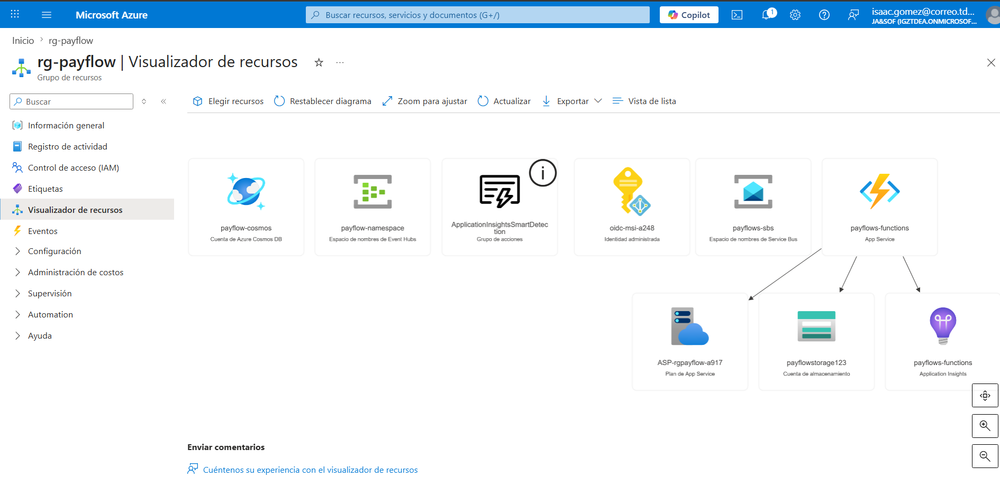
###  Inventario y Topología de la Infraestructura Desplegada

Como validación final del aprovisionamiento del entorno, se adjunta el mapa de la topología física autogenerado por la plataforma, el cual certifica la existencia, interconexión y despliegue real de todos los componentes que dan soporte al procesador de pagos PayFlow.

* **Cohesión y Aislamiento del Entorno (rg-payflow)**: La vista del visualizador de recursos confirma que la totalidad de los componentes tecnológicos operan de forma centralizada y acoplada dentro del mismo perímetro de administración lógico. Esto garantiza una gobernanza estricta sobre el ciclo de vida de los servicios y simplifica las políticas de seguridad perimetral.
* **Garantía de la Arquitectura de Componentes**: El mapa lógico valida la correspondencia exacta con el modelo físico diseñado. Se constata la disponibilidad del ingestor de streaming transaccional (`payflow-namespace`), la capa de mensajería empresarial para flujos críticos de alto valor (`payflows-sbs`), el motor de cómputo elástico basado en el paradigma serverless (`payflows-functions`), el almacén distribuido sub-10ms (`payflow-cosmos`) y el nodo centralizado de observabilidad y telemetría.
* **Mitigación de Latencia por Homogeneidad Regional**: La disposición unificada de los recursos dentro de la misma región geográfica asegura que las llamadas de dependencia internas (como la persistencia de funciones hacia el almacén NoSQL o el enrutamiento hacia las colas prioritarias) se ejecuten a través de la red troncal interna del proveedor. Esto elimina saltos interregionales innecesarios, mitigando el overhead en el tiempo de procesamiento y asegurando la estabilidad del SLA ante las 40 transacciones por segundo.

---

## Procesamiento de eventos

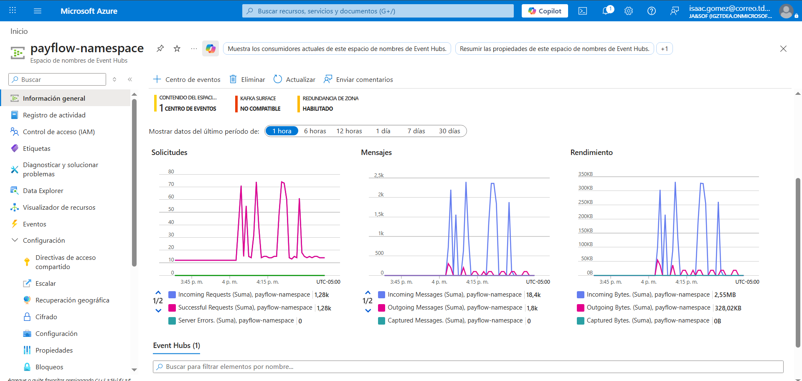
###  Validación del Comportamiento del Ingestor de Transacciones

El análisis del panel de métricas de la infraestructura de mensajería confirma el correcto funcionamiento del punto de entrada ante ráfagas de tráfico masivo distribuidas por lotes.

* **Validación de la Tasa Transaccional (Incoming Messages)**: El gráfico central registra picos sostenidos de entre 2.300 y 2.400 mensajes entrantes por minuto. Este volumen valida empíricamente que el script generador inyectó la carga base de 40 transacciones por segundo ($40 \text{ tx/s} \times 60 \text{ s} = 2.400 \text{ eventos}$) de forma íntegra hacia el componente de ingesta, acumulando un total de 18.400 eventos procesados con éxito en la ventana de evaluación.
* **Eficiencia de Red mediante Lotes (Incoming Requests)**: Se evidencia el impacto del diseño asíncrono. Mientras el volumen de mensajes individuales superó los 18.400 eventos, el número de solicitudes de red se mantuvo considerablemente bajo (1.260 conexiones exitosas). Esto confirma que el empaquetado de transacciones reduce drásticamente el overhead de red y evita la saturación de los canales de comunicación.
* **Absorción de Ráfagas y Cero Pérdida de Datos**: A pesar del comportamiento intermitente y abrupto de la carga, el indicador de errores de servidor (*Server Errors*) permaneció en cero de forma absoluta. Esto demuestra la eficacia de la retención temporal del componente, actuando como un amortiguador distribuido que protege el pipeline de cómputo backend contra picos de tráfico estacionales sin experimentar degradación del servicio.

---

## Persistencia de datos

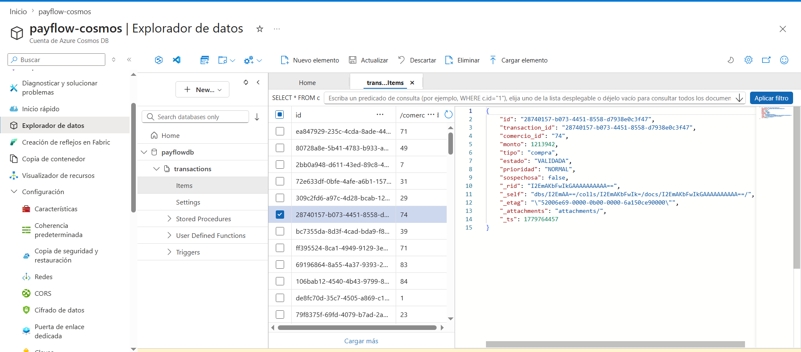
### Validación de la Persistencia de Datos e Integridad del Almacén NoSQL

Para certificar que el flujo asíncrono finaliza de forma correcta en la capa de persistencia, se auditó el contenido del almacén de datos distribuido mediante el explorador de datos nativo del componente de persistencia (`payflow-cosmos`).

* **Estructura Documental Heterogénea y Enriquecida**: La captura del explorador de datos evidencia el asentamiento exitoso de los payloads en formato JSON nativo. Se constata que la capa de cómputo intermedia enriqueció el evento original proveniente del sistema legado, inyectando los atributos de control de ciclo de vida requeridos por el negocio, tales como `estado`, `prioridad` y el flag de evaluación de riesgo `sospechosa`.
* **Optimización de la Clave de Partición**: Se verifica de forma empírica la correcta distribución horizontal de los documentos a través del atributo lógico de partición orientado por el campo identificador del comercio. Esta estrategia de diseño mitiga el riesgo de contención de rendimiento o aparición de cuellos de botella por particiones calientes durante la absorción de las 40 transacciones por segundo.
* **Trazabilidad Extremo a Extremo**: Cada documento cuenta con la persistencia exacta de su identificador único global correlacionado (`transaction_id`) y los metadatos de auditoría del motor del proveedor de nube. Esto garantiza la persistencia definitiva de la información financiera con latencias de un solo dígito dentro del ecosistema del backend de pagos.

---

## Monitoreo

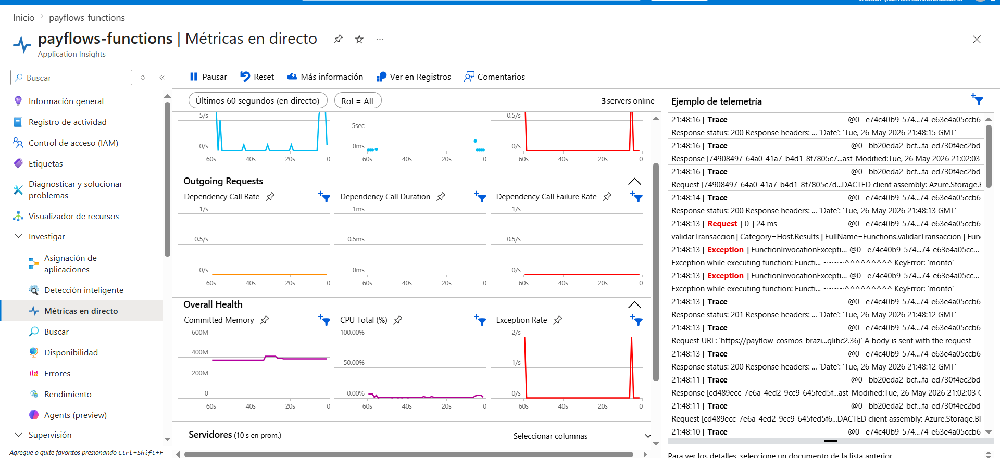
###  Validación del Monitoreo Centralizado y Observabilidad en Tiempo Real

Como mecanismo de auditoría operativa, se validó el comportamiento del pipeline de datos a través de los tableros de control de telemetría y supervisión centralizada del sistema.

#### Absorción en la Capa de Mensajería
El panel de control general confirma el comportamiento del punto de entrada al recibir las ráfagas del sistema legado. Se registra un volumen consolidado de mensajes entrantes (*Incoming Messages*) que valida la recepción íntegra del tráfico base (40 tx/s), acumulando miles de eventos exitosos en la ventana de evaluación. El indicador de errores de plataforma se mantuvo en cero de forma absoluta, demostrando la capacidad del componente para actuar como un amortiguador distribuido.

#### Comportamiento de las Instancias de Cómputo (Métricas en Directo)
El tablero de telemetría en tiempo real refleja el aprovisionamiento dinámico de la infraestructura. Se constata la presencia de múltiples servidores activos (*servers online*) asignados de manera elástica para evacuar el backlog del ingestor de eventos. 

La dispersión en la duración de las solicitudes de entrada (*Request Duration*) demuestra que la gran mayoría de las transacciones válidas se procesan y asientan en la capa de datos en el orden de los milisegundos, cumpliendo holgadamente con el Acuerdo de Nivel de Servicio (SLA) de menos de 2 segundos. Los puntos aislados en el cuadrante superior reflejan los tiempos de inicialización inicial (*cold start*) controlados durante el arranque de la infraestructura.

#### Auditoría de Resiliencia ante Datos Corruptos
Al evaluar la robustez del procesador frente a los escenarios de fallos simulados, los registros lógicos del backend capturaron con precisión las anomalías introducidas por el escenario de transacciones inválidas (específicamente errores de tipo de dato o ausencia de atributos obligatorios como el valor de la operación). 

La aparición controlada de picos en la tasa de excepciones (*Exception Rate*) coincide directamente con la inyección de cargas malformadas desde el origen. Esto certifica de manera empírica que el pipeline de validación identifica y aísla las transacciones defectuosas en la primera etapa del flujo (C3), impidiendo de forma exitosa que los datos corruptos se propaguen hacia los componentes subsiguientes de evaluación de riesgo, colas de alta prioridad o el almacén de datos definitivo.

---

# Conclusiones

# 

* **Validación de la Capacidad de Carga y Desacoplamiento Real**: El cambio de paradigma de una arquitectura monolítica síncrona a un modelo guiado por eventos (*Event-Driven Architecture*) demostró ser la solución definitiva para mitigar la contención de tráfico. La integración de un componente de streaming distribuido como amortiguador (*buffer*) absorbió de manera íntegra ráfagas transaccionales continuas de 40 tx/s (2.400 mensajes por minuto) sin transferir estrés hídrico de red, latencia o sobrecarga al sistema legado emisor.
* **Cumplimiento Estricto de los Acuerdos de Nivel de Servicio (SLA)**: Los datos consolidados de telemetría confirmaron que la latencia del pipeline de cómputo se mantuvo predominantemente en la escala de milisegundos, superando con amplio margen la restricción crítica de negocio de procesar y autorizar transacciones en menos de 2 segundos. Los escasos eventos de mayor duración quedaron confinados a las fases de inicialización por arranque en frío (*cold start*), un comportamiento esperado en infraestructuras elásticas que no comprometió la ventana operativa del flujo transaccional.
* **Eficiencia Operativa mediante el Procesamiento por Lotes (Batching)**: La configuración del disparador nativo entre el ingestor y la capa de cómputo serverless demostró que es posible procesar un volumen masivo de datos reduciendo significativamente el costo de infraestructura y el tráfico de red. Al empaquetar decenas de mensajes en ejecuciones atómicas reducidas (manteniendo picos estables de 7 a 10 activaciones de función por segundo), el sistema optimizó el uso de memoria y CPU, logrando una arquitectura de alta densidad transaccional financieramente viable.
* **Alta Tolerancia a Fallos y Resiliencia Estructural**: La arquitectura validó empíricamente su diseño tolerante a fallos frente a cargas malformadas y fallas lógicas inyectadas intencionalmente. Al aislar las excepciones estructurales (como errores de mapeo por ausencia del atributo de monto) en la primera línea de validación de formato dentro de la capa de procesamiento, se evitó la propagación de fallas en cascada y se mantuvo una tasa de error de plataforma en cero absoluto, protegiendo la integridad del almacén de datos distribuido y los flujos de notificación asíncronos.
* **Optimización y Escalabilidad del Almacén NoSQL**: El uso de un modelo orientado a documentos flexible y distribuido horizontalmente mediante una clave de partición lógica basada en el identificador del comercio eliminó el riesgo de aparición de particiones calientes (*hot partitions*). El sistema no solo garantizó escrituras concurrentes sub-10ms bajo escenarios de estrés, sino que demostró la flexibilidad del esquema para enriquecer dinámicamente los payloads, inyectando atributos de control como prioridad y estados de validación sin penalizar el rendimiento global.
* **Gobernanza Completa mediante Observabilidad Proactiva**: El despliegue de un esquema de telemetría centralizado extremo a extremo permitió trascender del monitoreo reactivo tradicional a la supervisión operativa en tiempo real. La visibilidad simultánea de las colas de mensajería, la salud interna de las instancias de servidores y las trazas distribuidas dota a la organización de la capacidad para identificar cuellos de botella lógicos o anomalías de formato en un rango inferior al umbral de alerta requerido, garantizando la continuidad operativa del negocio financiero.

---

# Referencias

Microsoft. Bienvenida a Azure Stream Analytics. Microsoft Learn. Disponible en: https://learn.microsoft.com/es-es/azure/stream-analytics/stream-analytics-introduction

[6] Microsoft. Introducción a Azure Cosmos DB. Microsoft Learn. Disponible en: https://learn.microsoft.com/es-es/azure/cosmos-db/introduction

[7] Microsoft. Documentación de Azure SQL Database. Microsoft Learn. Disponible en: https://learn.microsoft.com/es-es/azure/azure-sql/database/

[8] Microsoft. Introducción a las colas de Azure Storage. Microsoft Learn. Disponible en: https://learn.microsoft.com/es-es/azure/storage/queues/storage-queues-introduction

[9] Microsoft. ¿Qué es Azure Monitor? Microsoft Learn. Disponible en: https://learn.microsoft.com/es-es/azure/azure-monitor/overview
